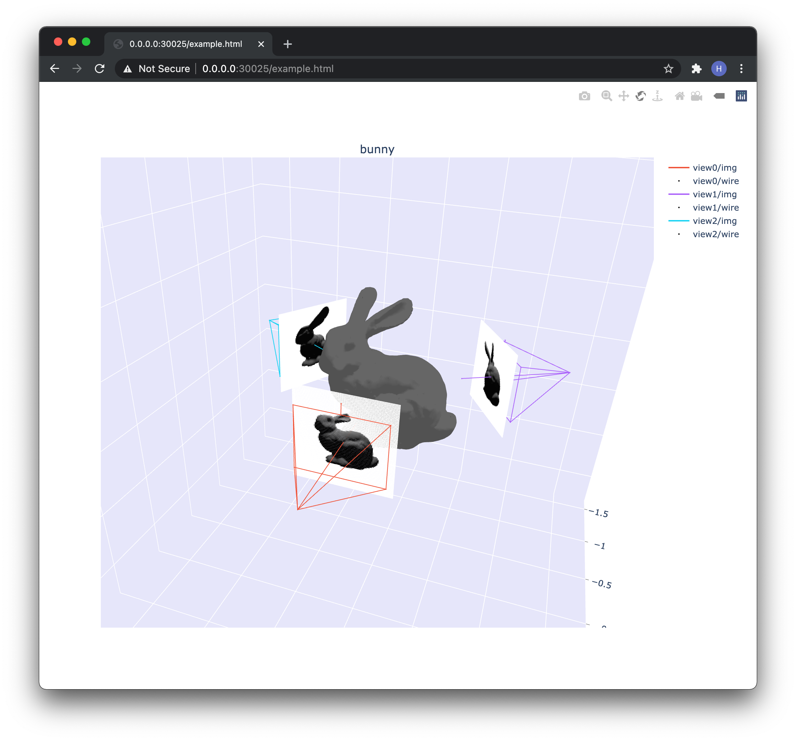

# MVS visualization toolkit
Visualizing multiple cameras along with the scene interactively. Empowered by plotly, also work on remote server.

## Setup
```bash
conda create -n mvs_visual python=3.8
conda activate mvs_visual && pip install -r requirements.txt

# for pyopengl to work properly, needed for running the example.
export PYOPENGL_PLATFORM="egl"
# manually fix the bug in pyopengl according to this issue.
# https://github.com/mcfletch/pyopengl/issues/27#issuecomment-511124488
```

## Example
```bash
python example.py

# on remote server.
python -m http.server 30025
# on local machine.
ssh -N -L 30025:localhost:30025 <REMOTE_SERVER_SSH_NAME>
```
You should be able to see a few rendered bunny images from different views saved as `view*.png`, as well as an `example.html`.
Open that html file in your browser, you should be able to see something like this:



## Note
This visualization toolkit is largely inspired by the pytorch3D [example](https://github.com/facebookresearch/pytorch3d/blob/master/pytorch3d/vis/plotly_vis.py).

I changed everything to OpenGL camera format (right/up/back corresponding to +x/y/z in camera frame) and dropped the support for pytorch3D cameras, thus using trimesh + pyrender for rendering etc.

Currently support rendering meshes, camera wireframes along with the images,
point clouds, line segments, and 3D skeletons.

## Known issues
1. Currently only support isotropic imaging, meaning cameras are expected to
   have equal heights and weights, equal focals along both x/y directions, and
   equal principal points at the center of the image.
2. Currently only support OpenGL format camera. Supporting different camera
   formats will be nice, including Pytorch3D, Blender, OpenCV etc.
3. Subplots will become pretty small if there are more than 4 (2x2). This is an
   issue related to plotly without any open solution as far as I know.

Issues and PR are welcomed.
